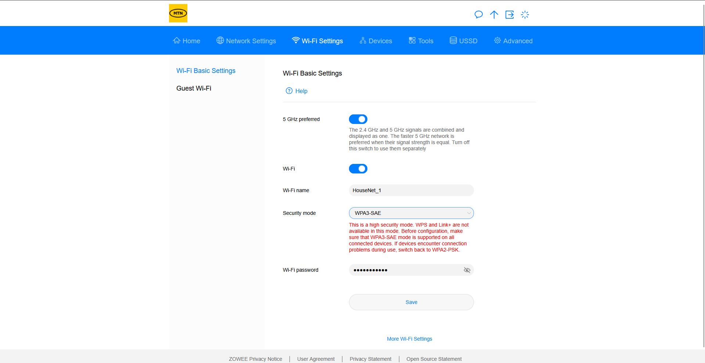
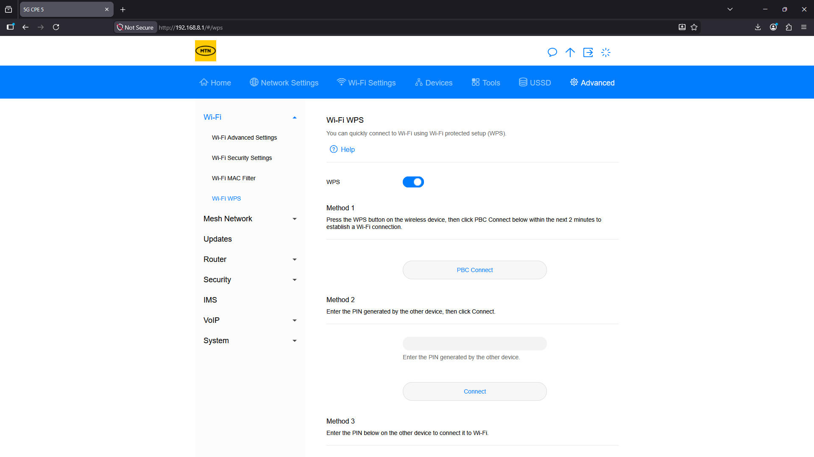
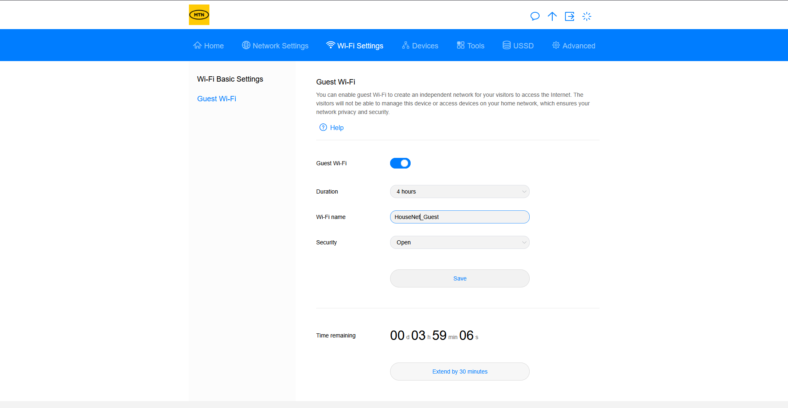

# Home-Network-Hardening-Project

Overview

This project demonstrates the secure configuration and hardening of a home wireless network. The objective was to improve the security posture of a newly installed wireless access point by implementing cybersecurity best practices and reducing common attack vectors.

The project focused on strengthening wireless authentication, replacing insecure default configurations, disabling unnecessary features, and implementing guest network segmentation to improve overall network security.

Project Objectives

* Secure a newly installed wireless access point
* Implement stronger wireless authentication
* Replace insecure default configurations
* Reduce the attack surface of the wireless network
* Create a separate guest network
* Apply cybersecurity best practices in a home environment

Network Overview

* Network Type: Home Wireless Network

* Primary SSID: HouseNet_1

* Wireless Band: 5 GHz

* Security Protocol: WPA3-SAE

* WPS Status: Disabled

* Guest Network: Enabled

* Guest SSID: HouseNet_Guest

Security Configuration Process

1. Primary Wireless Network Configuration

The first step was to configure the primary wireless network to improve both security and performance.

The default wireless network name (SSID) was changed to HouseNet_1. Using a custom SSID avoids reliance on default naming conventions and provides a cleaner and more personalized network configuration.

The wireless network was configured to operate on the 5 GHz frequency band. This frequency generally provides improved performance and reduced interference compared to older wireless frequencies.

The wireless security protocol was upgraded from WPA2-PSK to WPA3-SAE. WPA3 provides stronger authentication mechanisms and improved protection against password-guessing attacks, making it a more secure choice for modern wireless networks.
Password Hardening

The default wireless password was replaced with a strong and complex password.

Default passwords may be publicly available through manufacturer documentation or online resources. To reduce the risk of unauthorized access, a unique password was created using a combination of uppercase letters, lowercase letters, numbers, and special characters.

Implementing a strong password improves resistance against dictionary attacks, brute-force attacks, and password guessing attempts.

Security Benefit: Reduced risk of unauthorized access through weak or default credentials.

2. Disabling Wi-Fi Protected Setup (WPS)

Wi-Fi Protected Setup (WPS) was disabled as part of the network hardening process.

Although WPS was originally designed to simplify wireless device connections, certain implementations have historically been vulnerable to brute-force attacks against PIN-based authentication methods.

Disabling WPS removes this potential attack vector and ensures that devices connect using the stronger WPA3 authentication mechanism.

Security Benefit: Reduced attack surface and elimination of potential WPS-related vulnerabilities.

3. Guest Wireless Network Configuration

A separate guest wireless network was created to provide internet access for visitors without granting access to the primary network.

The guest network was configured with the SSID HouseNet_Guest. Access duration was limited to 4 hours, ensuring that guest access is automatically restricted after the specified period.

Guest network segmentation helps protect internal devices by separating guest traffic from the main network.

Security Benefit: Improved network segmentation and reduced exposure of internal devices.

Security Improvements Achieved

Default Credentials

* Replaced the default wireless password with a strong custom password.

Wireless Authentication

* Upgraded security from WPA2-PSK to WPA3-SAE.

WPS Vulnerabilities

* Disabled WPS to remove potential attack vectors.

Network Identification

* Replaced the default SSID with a custom network name.

Guest Network Security

* Created a separate guest network for visitors.

Access Control

* Limited guest network access to 4 hours.

Lessons Learned

Through this project, I gained practical experience in securing a wireless access point and applying cybersecurity best practices in a real-world environment.

Key lessons learned include:

* The importance of changing default network configurations.
* The security advantages of WPA3-SAE over older wireless authentication methods.
* The importance of replacing default credentials with strong passwords.
* The risks associated with WPS and the benefits of disabling unnecessary services.
* The value of network segmentation through guest wireless networks.
* How small configuration changes can significantly improve the security posture of a network.

Technologies and Concepts

* Wireless Network Security
* WPA3-SAE Authentication
* Access Point Configuration
* Network Hardening
* Password Security
* Guest Network Segmentation
* Wi-Fi Security Best Practices
* Cybersecurity Fundamentals

Conclusion

This project successfully improved the security of a newly installed home wireless network through the implementation of network hardening techniques.

By configuring WPA3-SAE authentication, replacing default credentials with a strong password, disabling WPS, and implementing a separate guest network, the overall security posture of the wireless environment was significantly strengthened.

This project demonstrates practical cybersecurity skills related to wireless security, access point management, network hardening, and security configuration. These skills are applicable in both home and enterprise networking environments.
